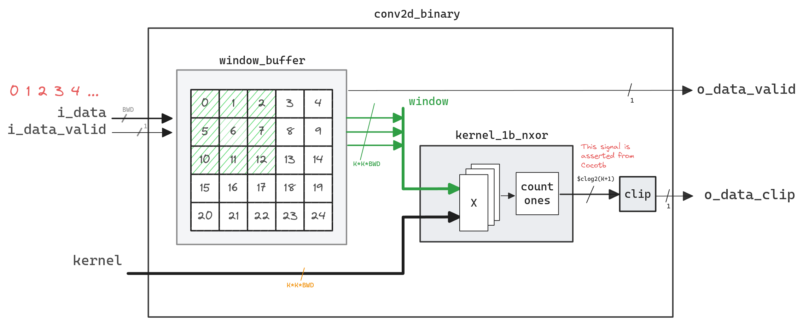

# Top level diagram



Future enchancments:

- [ ] Replace nXOR kernel with fix-point unsigned arithmetic dot-product
- [ ] Update convolution mechanism. It's not necessary to catch all window simultaneously. Instead, window can be processed column-by-colum in a FIR manner. This will make implementation of convolution DSP48-friendly


# Simulation & Verification
Cocotb simulation was used to generate input stimulus and assert output values

**Requirements**
- `verilator` 
- `cocotb`
- `numpy`
 
`Makefile` contains all the required configurations to run simulation
Run `make` and cocotb will run simulation via VPI interface to verilated binaries
See the end of this example for example log

Future enchancments:

- [ ] Break common test to Testbench and various test-cases
- [ ] Chance input-output interface to packed-streaming 
- [ ] Cover various combinations of N & K, only several are covered manually

# Window Buffer 2D

There 2 version of window buffer mechanims are presented now

- Use version 1 in case of relatively small `N,K,BDW` (initial case)
- use version 2 for large image processing (better for extended versions)

Future enchancments:
- [ ] Utilize BRAM for data storage
- [ ] Implement "classic" 2D convolution Kernel

### Version 1. 2D Grid

**Benefits**
- Design has constant logic complexity of the critical path (multiplexor 2 to 1)

**Drawback**
- Because of the mesh (or 2D grid) structure, where each element has two inputs, this design is not suitable for SRL or BRAM, resource efficient, memory storage


### Version 2. SRL-Friendly
**Benefits**
- Feasable for SRL implementation, (N-K)*K registers can be fitted to SRL or BRAM (in future)

**Drawback**
- Data-input (1 to K) demultiplexor and output multiplexors  (K to 1)  may affect critical path in case of large K (> 32)

<details>
  <summary>Click me to see images</summary>


</details>


## Window Mechanism validation
Window mechanism verification with binary values may be obscured, so to simplify window-logic validation, 


- Extend bit-width parameter `BWD` to `8`
- Use incrementing counter value to represent indexes as values

See waveform wxample with  `N_IMAGE=5, BWD=8, K_KERNEL=3` 
```
Image values

[[ 0  1  2  3  4]
 [ 5  6  7  8  9]
 [10 11 12 13 14]
 [15 16 17 18 19]
 [20 21 22 23 24]]

```


<details>
  <summary>Click me to see Window Buffer V1 workflow</summary>


</details>

<details>
  <summary>Click me to see Cocotb Run Log</summary>

```
(base) kvinogradov@blackbox:~/work/fpga/conv$ make
rm -f results.xml
make -f Makefile results.xml
make[1]: Entering directory '/home/kvinogradov/work/fpga/conv'
rm -f results.xml
MODULE=test_conv2d_binary TESTCASE= TOPLEVEL=conv2d_binary TOPLEVEL_LANG=verilog \
         sim_build/Vtop 
     -.--ns INFO     gpi                                ..mbed/gpi_embed.cpp:76   in set_program_name_in_venv        Did not detect Python virtual environment. Using system-wide Python interpreter
     -.--ns INFO     gpi                                ../gpi/GpiCommon.cpp:101  in gpi_print_registered_impl       VPI registered
     0.00ns INFO     cocotb                             Running on Verilator version 5.020 2024-01-01
     0.00ns INFO     cocotb                             Running tests with cocotb v1.8.1 from /home/kvinogradov/anaconda3/lib/python3.11/site-packages/cocotb
     0.00ns INFO     cocotb                             Seeding Python random module with 1706469030
     0.00ns INFO     cocotb.regression                  Found test test_conv2d_binary.basic_test
     0.00ns INFO     cocotb.regression                  running basic_test (1/1)
     0.00ns INFO     cocotb                             Image values
     0.00ns INFO     cocotb                             [[1 0 0 0 1 1 1 1]
                                                         [0 0 1 1 0 0 1 0]
                                                         [1 1 0 0 0 1 0 1]
                                                         [1 1 0 0 0 0 1 0]
                                                         [1 0 0 0 0 0 0 0]
                                                         [0 0 0 0 1 1 1 0]
                                                         [1 1 1 1 1 1 1 1]
                                                         [0 1 0 0 0 1 0 1]]
     0.00ns INFO     cocotb                             Kernel values
     0.00ns INFO     cocotb                             [[1 1 0]
                                                         [1 1 0]
                                                         [1 1 1]]
     0.00ns INFO     cocotb                             Expected dot-product
     0.00ns INFO     cocotb                             [[4. 3. 3. 4. 3. 6.]
                                                         [5. 4. 4. 2. 3. 4.]
                                                         [7. 4. 2. 1. 2. 3.]
                                                         [5. 3. 3. 4. 4. 5.]
                                                         [6. 5. 4. 5. 6. 7.]
                                                         [4. 4. 2. 4. 5. 7.]]
   765.00ns INFO     cocotb.regression                  basic_test passed
   765.00ns INFO     cocotb.regression                  ***************************************************************************************
                                                        ** TEST                           STATUS  SIM TIME (ns)  REAL TIME (s)  RATIO (ns/s) **
                                                        ***************************************************************************************
                                                        ** test_conv2d_binary.basic_test   PASS         765.00           0.01      77421.26  **
                                                        ***************************************************************************************
                                                        ** TESTS=1 PASS=1 FAIL=0 SKIP=0                 765.00           0.16       4658.56  **
                                                        ***************************************************************************************
```
</details>